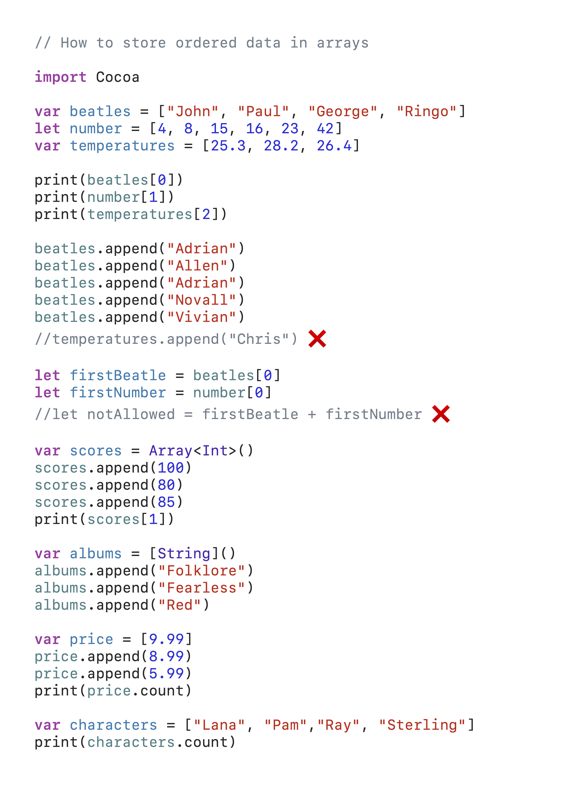
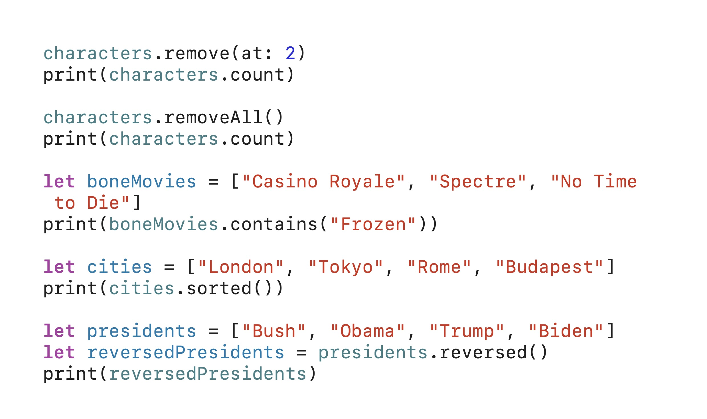
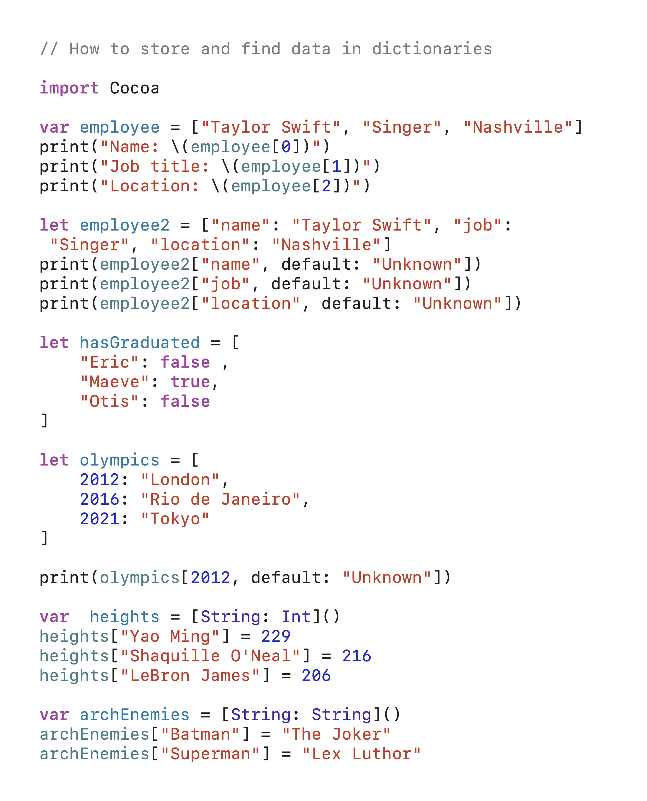
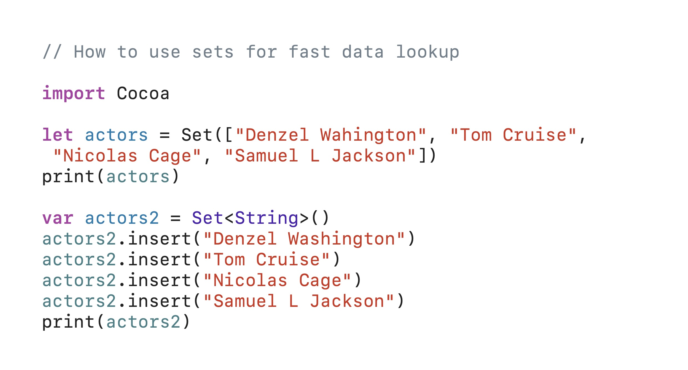
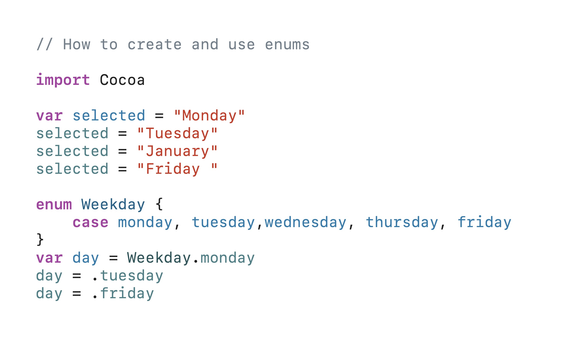

# Day 003 — Arrays, dictionaries, sets, and enums

> Part of my [100 Days of SwiftUI](../../README.md) journey.

**Date:** 2026-07-06

---

## 📚 Topics Learned
- Arrays
- Dictionaries
- Sets
- Enums

## 🧗 Challenges

Remembering and writing the code was difficult but reading and understanding it was simple.

## 💡 What I Learned

I learned about arrays, dictionaries, sets, enums and their differences. I also improved my string writing skills by learning how to store more strings in a single variable.

## 📸 Screenshots

## 🔗 Resources

- [100 Days of SwiftUI — Day 3](https://www.hackingwithswift.com/100/swiftui/3)

## 🎯 Next Goals

My next goal is to stay focussed on this topic because it’s important to master it completely.
