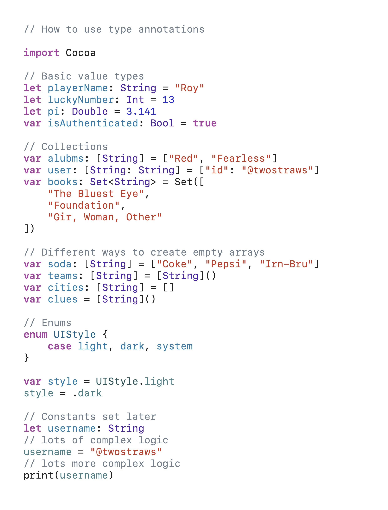
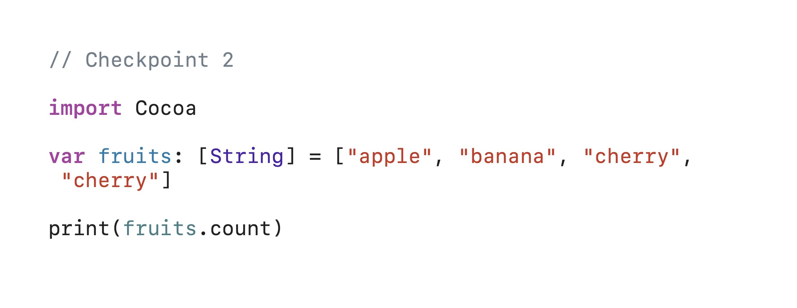

# Day 004 — Type annotations and checkpoint 2

> Part of my [100 Days of SwiftUI](../../README.md) journey.

**Date:** 2026-07-10

---

## 📚 Topics Learned

- type annotations

## 🛠️ What I Built

I had to create an array of strings, then to write some code that prints the number of items in the array and also the number of unique items in the array.

## 🧗 Challenges

I've found it difficult to remember a lots of things, but Paul said multiple times that is not a problem and we should practice further.

## 💡 What I Learned

I learned how to write type annotations so that Swift doesn't choose the type but it follows my rules.

## 📸 Screenshots

## 🔗 Resources

- [100 Days of SwiftUI — Day 4](https://www.hackingwithswift.com/100/swiftui/4)

## 🎯 Next Goals

My next goal is to keep practice to I learn new skills.
